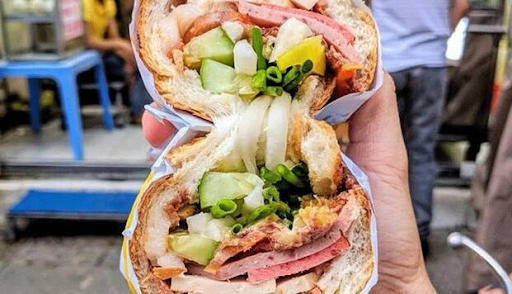
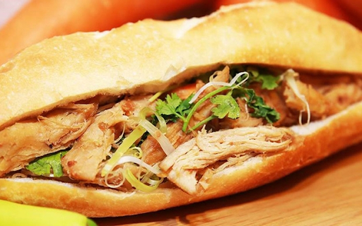
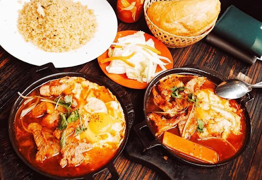
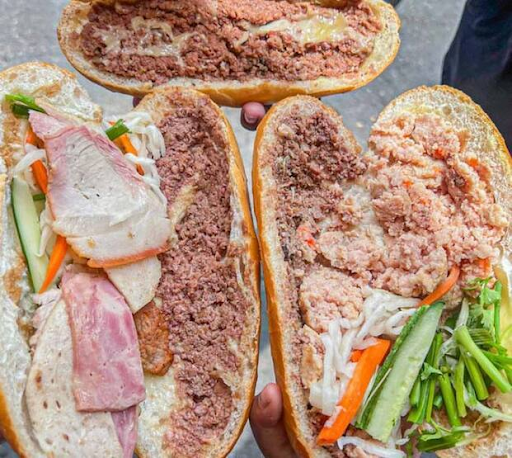
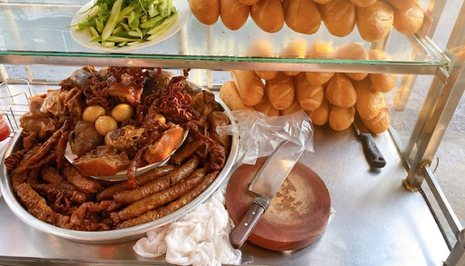

Có lẽ đối với cả người Việt Nam và bạn bè quốc tế, bánh mì không còn là một món ăn đơn thuần mà từ lâu đã trở thành nét đẹp văn hóa ẩm thực đặc biệt của dải đất chữ S, khiến người ta không để kìm lòng mà nhớ thương.

Mỗi người con đất Việt, ắt hẳn ai cũng đã quen thuộc với những ổ bánh mì, từ mấy câu rêu rao “Bánh mì Sài Gòn, năm ngàn một ổ” đến hương bánh mì thơm lừng ngây ngất lan tỏa khắp mọi nẻo đường quê. Dù là ở ngõ ngách nào của đất nước, ta cũng dễ dàng bắt gặp hình ảnh những xe bán bánh mì di động, mấy quầy bánh mì nhỏ ven đường với vài chiếc ghế nhựa, hay những bác đạp xe lóc cóc chở một giỏ bánh mì phủ kín chiếc bao bố sau lưng, tựa như một nét đẹp văn hóa không thế thiếu.

Cái mà bánh mì chứa đựng không chỉ là phần nhân thơm lừng và đậm đà hương vị của thịt nướng, xúc xích, trứng chiên, chả cá,… mà còn là kỉ niệm của cả một đời người. Đó là những ngày thơ bé cắp sách đến trường với ổ bánh mì nóng hổi mà mẹ ân cần mua cho, hay mấy lần bẻ nửa ổ bánh mì rồi dúi vào tay đứa ngồi bên cạnh và nói: “Nè! Cho mày nửa ổ, lát nữa nhớ chỉ bài cho tao!”.

Bánh mì là một món ăn bình dị, nên đến cách ăn cũng mộc mạc và chân chất. Những cô cậu bận rộn có thể thưởng thức hương vị thơm ngon này ngay khi cầm ổ bánh mì trên tay. Đôi lúc lại bắt gặp hình ảnh vài đứa trẻ ngồi bệt trên bậc thềm của một căn nhà nào đấy còn chưa mở cửa để ngấu nghiến một ổ bánh mì. Cũng có nhiều người thích ngồi trên chiếc ghế nhựa cạnh bên dãy bàn giản dị trải dọc con phố nhỏ để tận hưởng bữa sáng và ngắm nhìn thành phố đang dần thức dậy.

Hiếm có thể tìm thấy món ăn nào vừa ngon rẻ vừa phong phú và tiện lợi như bánh mì. Mỗi ổ bánh mì lại được quy tụ từ biết bao sự tinh tế và kỉ niệm của những thế hệ trôi qua. Cái mà chúng ta thưởng thức ở một ổ bánh mì dường như không chỉ là hình thức hay hương vị, mà còn là tinh hoa ẩm thực và vẻ đẹp của cả một dân tộc được đúc kết. Có lẽ vì vậy mà không ít người con xa xứ vẫn mang nỗi niềm nhớ thương dành cho những ổ bánh mì vương đậm cái tình và cái hồn của quê nhà.

Không chỉ người Việt Nam, bạn bè quốc tế cũng đem lòng yêu mến món ăn bình dị và đơn sơ này. Ổ bánh mì của quê hương đang càng ngày càng khẳng định vị thế ở làng ẩm thực thế giới, đến mức tờ báo The Guardian phải viết rằng: “Một điều bí mật mà không mấy người biết là món sandwich ngon nhất thế giới không phải được tìm thấy ở thành phố Rome, Copenhagen hay New York mà ở Việt Nam”.

Nếu trước đây, khách du lịch đặt tên bánh mì là “Vietnamese baguette” hay “Vietnamese sandwich”, thì bây giờ người ta đã ưu ái gọi món ăn quen thuộc này bằng hẳn một cái tên riêng là “Banh Mi”. Danh xưng tưởng chừng đơn giản này lại là minh chứng cho một sự ngưỡng mộ và say mê, mà dù là người nước nào cũng nhất định phải nói tiếng Việt để có thể được thưởng thức trọn vẹn hương vị chỉ có ở mảnh đất này.

Không khó để tìm ra những nhà hàng Pháp, Nhật, Hàn,… nổi tiếng ở Việt Nam. Thế nhưng, có nhiều người không biết rằng món bánh mì của đất nước mình cũng được ưu ái góp mặt trong những địa điểm rất được yêu thích của nước bạn. Đó là cửa hàng “Banh mi My Tho” ở Mỹ hay “Banh Mi Bay” của Anh. Đó còn là những cái tên được người bản địa chú ý và săn đón như xe bán bánh mì lưu động khắp thành phố tại Thái Lan hay thương hiệu “Ô Bánh Mì” rất lớn tại Malaysia.

Có thể nói, bánh mì được người nước ngoài say mê không phải là một điều quá bất ngờ. Bởi lẽ món ăn này chính là sự giao thoa và kết hợp hoàn hảo giữa ẩm thực phương Tây và Việt Nam.

Mỗi ổ bánh mì đều được đúc kết từ những tinh túy, ấp ủ, chắt chiu và kinh nghiệm của bao nhiêu thế hệ, với những đặc điểm gần gũi với người phương Tây mà vẫn giữ được hương vị tinh tế của người châu Á. Bánh mì còn mang đầy đủ đặc điểm của một món ăn mà bất cứ người hiện đại nều trên thế giới cũng nên thưởng thức qua: rẻ, ngon, phong phú, tiện lợi.

Bánh mì không chỉ là “tri kỉ” của mỗi người dân Việt Nam, mà còn là “cầu nối” lí tưởng để con người Việt đến gần hơn với bạn bè năm châu bốn bể. Thật tuyệt vời khi ẩm thực Việt Nam ngày càng được thế giới yêu quý và mến mộ, cũng như nét đẹp văn hóa và phong thái dân tộc không ngừng được lưu giữ từ chính những điều giản dị và đơn sơ nhất.

Đặt chân đến Sài Gòn mà không thử bánh mì thì đúng là một sai sót lớn trong đời đấy, nên hãy xem ngay list những tiệm bánh mì ngon, nổi tiếng nhất ở thành phố mang tên Bác và thử ngay nhé.

**Bánh mì Huỳnh Hoa**

Địa chỉ: Số 26 Lê Thị Riêng - Phạm Ngũ Lão - Quận 1 - TP. Hồ Chí Minh.

Mặc dù giá thành khá cao nhưng bánh mì Huỳnh Hoa là ví dụ chính xác cho câu nói “Tiền nào của nấy” vì ổ bánh mì có trọng lượng lên đến 500gr. Topping trong bánh mì phải nói là đầy ụ gồm chả, chà bông, pate, rau, thịt nguội, thịt hun khói, bơ vàng,… Nhờ vào sự kết hợp nguyên liệu khác nhau nên bánh mì Huỳnh Hoa có sức hút đặc biệt và là một cái tên nằm toplist khi ai đó nhắc đến tiệm bánh mì ngon ở Sài Gòn.

#### _Bánh mì Huỳnh Hoa với topping ú ụ_

**Bánh mì Ngọc Mai**

**_Địa chỉ:_** _Số 275 Phan Xích Long - Phường 7 - Phú Nhuận - TP. Hồ Chí Minh._

**_Bánh mì Ngọc Mai_** _là một địa điểm quen thuộc với người dân Phú Nhuận. Bánh mì ở đây có hương vị gia truyền hơn 30 năm với topping ú ụ gồm thịt,pate, rau và nước sốt gia truyền cực hấp dẫn. Đặc biệt là tiệm bánh còn hoạt động 24/24 nên bạn có thể ghé mua và thưởng thức bất cứ lúc nào._

**Bánh mì chảo cô Ba Hậu**

**_Địa chỉ:_** _36 đường số 18 - Phường 8 - Gò Vấp - TP. Hồ Chí Minh_

_Nếu ngán bánh mì kẹp thịt truyền thống, bạn có thể thay đổi một chút với bánh mì chảo. **Bánh mì chảo cô Ba Hậu** mang hương vị riêng bởi công thức nước sốt gia truyền đạm đà. Một phần đầy đủ của bánh mì chảo sẽ gồm có trứng ốp, thịt bò, xíu mại, pate kèm theo rau củ ăn kèm để không ngán._

#### _Bánh mì chảo với nhiều topping và đồ ăn kèm nhà làm_

**Bánh mì Kim Dung**

**_Địa chỉ:_** _118A Lý Thường Kiệt - Phường 7 - Quận 10 - TP. Hồ Chí Minh._

_**Bánh mì Kim Dung** chắc chắn là cái tên nổi tiếng với các thế hệ học sinh trường Trần Nhân Tôn. Bánh mì ở quán này là sự kết hợp hoàn hảo giữa rau, thịt, pate và nước sốt. Quán còn có nhiều loại bánh khác như bánh mì bì, bánh mì pate – thịt – chả – chà bông, bánh mì pate – gà, bánh mì pate – xíu mại, bánh mì thập cẩm._

#### _Bánh mì chảo với nhiều topping và đồ ăn kèm nhà làm_

Bánh mì phá lấu Bà Sáu

**Địa chỉ:** Số 104 Hoàng Diệu - Phường 12 - Quận 4 - TP. Hồ Chí Minh.

Bánh mì ở đây được yêu thích nhờ thịt phá lấu lòng heo có hương vị vô cùng đậm đà nhờ vào công thức riêng của tiệm. Phá lấu được chế biến vệ sinh, không bị hôi và hương vị bắt miệng, rất thích hợp để ăn với bánh mì vào những ngày mưa se se lạnh.

