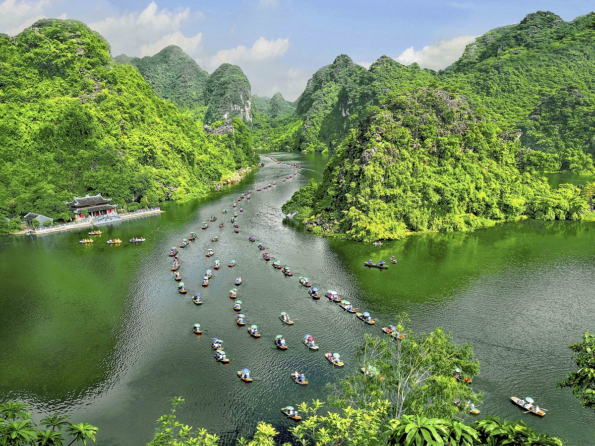
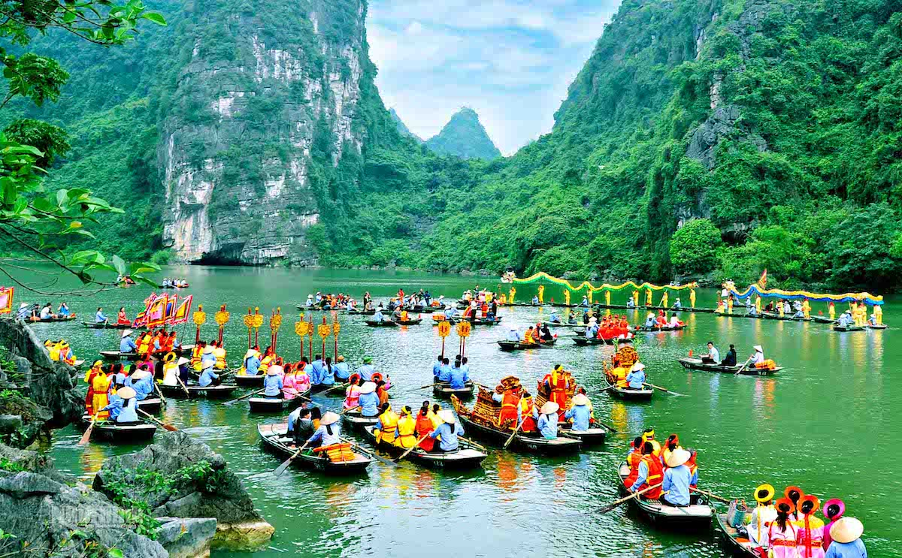

_Được kiến tạo cách đây khoảng 250 triệu năm, Tràng An (Ninh Bình) là khu vực có lịch sử tiến hóa địa chất nhiều biến động, trải qua nhiều đợt biển tiến, biển thoái. Khối đá vôi Tràng An được các nhà khoa học đánh giá là một trong những khu vực cảnh quan đá vôi dạng nón, tháp cổ điển đẹp nhất thế giới. Hòa giữa những khu rừng nguyên sinh là các thung lũng, hang động, sông nước và đình, đền, chùa, miếu, phủ._

#### Quần thể danh thắng Tràng An thu hút khách du lịch bởi nhiều cảnh đẹp thiên nhiên hùng vĩ, linh thiêng và các kỷ lục thế giới. (Nguồn ảnh: sưu tầm)

Khu vực di sản quần thể danh thắng Tràng An hiện có 429 di tích, trong đó có 2 di tích quốc gia đặc biệt, 21 di tích quốc gia và 36 di tích cấp tỉnh, được phân bố đều khắp 18 xã, phường. Đây là kinh đô đầu tiên của nhà nước Đại Cồ Việt, chứa đựng nhiều di tích lịch sử, tôn giáo nổi tiếng, các giá trị thiên nhiên và văn hóa độc đáo.

Nơi đây còn là cái nôi lưu giữ những nét văn hóa lúa nước, khởi đầu cho khai thác nguồn sinh dưỡng săn bắt, hái lượm từ rừng và biển, con người bắt đầu biết canh tác nông nghiệp. Qua thời gian, các lớp cư trú của cư dân cổ Tràng An cùng nhau bồi đắp nên các giá trị truyền thống trong quá trình lao động sản xuất, tạo ra những đặc trưng độc đáo của nền văn minh lúa nước.

Sau 10 năm Quần thể danh thắng Tràng An được UNESCO ghi danh là Di sản văn hóa và thiên nhiên thế giới, Tràng An đã khẳng định được là một trong những điểm đến du lịch nổi tiếng của Việt Nam và trên toàn thế giới; là nơi kết hợp một cách hài hòa giữa vẻ đẹp tự nhiên và những giá trị lịch sử, văn hóa, thể hiện những câu chuyện của lịch sử cổ xưa và là một cuốn biên niên sử nguyên vẹn ghi lại sự biến đổi môi trường và những ứng phó của con người trong quá khứ xa xôi, lưu giữ một truyền thống cư trú của con người, truyền thống sử dụng vùng đất, vùng biển của người tiền sử với nhiều nền văn hóa tiếp nối liên tục, kéo dài tới 30.000 năm.

#### Lễ hội Tràng An năm 2024 (Nguồn ảnh: sưu tầm)

Được biết, tỉnh Ninh Bình đang triển khai đề án đến năm 2030, cơ bản đạt tiêu chí thành phố trực thuộc Trung ương với đặc trưng Đô thị di sản thiên niên kỷ, thành phố sáng tạo. Theo đó, cố đô Hoa Lư chứa đựng cả một hệ sinh thái thiên niên kỷ, bao gồm di sản tự nhiên, di sản định cư, các di tích khảo cổ, lịch sử, bản sắc văn hóa, tôn giáo, tín ngưỡng có giá trị.

Ông Phạm Quang Ngọc, Chủ tịch Ủy ban nhân dân tỉnh Ninh Bình cho biết, Tràng An đang mang sứ mệnh mới, trở thành trung tâm của Đô thị di sản thiên niên kỷ, từ đó thúc đẩy phát triển du lịch của tỉnh.

Những năm gần đây, Tràng An là địa điểm nổi bật trong khu vực Đông Nam Á và thế giới, được UNESCO ghi danh. Đó là cơ sở để tỉnh Ninh Bình đầu tư và đón ngày càng đông khách du lịch. Mặc dù chịu ảnh hưởng bởi đại dịch Covid-19, nhưng tỉnh tiếp tục được nhiều chuyên trang du lịch uy tín như TripAdvisor, Telegraph, Business Insider... đánh giá là điểm đến an toàn và hấp dẫn.

Năm 2022, du lịch Ninh Bình phục hồi mạnh mẽ, đón 3,7 triệu lượt khách, tăng gấp 3,6 lần cùng kỳ năm trước; doanh thu tăng gấp 5 lần cùng kỳ năm 2021. Đến năm 2023, toàn tỉnh đón 6,6 triệu lượt khách, riêng quần thể danh thắng Tràng An đón khoảng 4,6 triệu lượt, doanh thu gần 6.500 tỷ đồng.

Trong 3 tháng đầu năm 2024, toàn tỉnh đón 3,9 triệu lượt khách, trong đó có gần 340.000 lượt khách quốc tế, đạt 52% chỉ tiêu đề ra của cả năm 2024. Danh thắng Tràng An chiếm đa số lượng khách.

#### Những dấu tích, di tích tại Hoa Lư đã và đang đóng vai trò quan trọng trong việc lưu giữ, truyền tải các giá trị văn hóa từ xa xưa để lại. (Nguồn ảnh: sưu tầm)

Nhiều năm liền, Ninh Bình cũng giữ vững vị trí trong nhóm 15 điểm đến hàng đầu, 10 tỉnh thu hút lượng khách cao nhất cả nước.

Để luôn giữ chân được khách du lịch trong và ngoài nước, tỉnh Ninh Bình luôn quan tâm chú trọng đến việc nâng cao ý thức của cán bộ, đảng viên và nhân dân trong việc bảo vệ cảnh quan thiên nhiên môi trường sống tại khu vực Tràng An. Điều đó đã tạo nên sự khác biệt biệt, riêng có của Tràng An.

Đến nay, nơi đây được ghi nhận là một trong số ít di sản chịu sự tác động của con người, thậm chí con người và thiên nhiên hòa thuận, mang lại lợi ích cho nhau. Sự chuyển dịch cơ cấu kinh tế từ nông nghiệp sang dịch vụ du lịch hướng tới tăng trưởng xanh và bền vững đã phát huy sức sống, tiềm năng và giá trị di sản, để di sản thực sự là của cộng đồng, do cộng đồng bảo vệ và gìn giữ.

Nhờ đó, số lao động trực tiếp tại khu vực quần thể danh thắng Tràng An khoảng hơn 10.000 người, lao động gián tiếp hơn 20.000 người, thu nhập của cộng đồng dân cư địa phương được nâng cao rõ rệt qua từng năm. Các khu, điểm du lịch trong khu di sản thực sự đóng vai trò là hạt nhân, thúc đẩy phát triển du lịch Ninh Bình.

Việc phát triển các sản phẩm du lịch di sản tại Quần thể danh thắng Tràng An không chỉ là phục vụ nhu cầu tham quan, trải nghiệm của khách du lịch và phát triển kinh tế du lịch, mà quan trọng hơn là thể hiện trách nhiệm trong gìn giữ, bảo tồn và phát huy các giá trị văn hóa và lịch sử, diễn giải các giá trị di sản một cách khoa học để bảo đảm rằng những giá trị quý báu này sẽ được lưu truyền cho các thế hệ hôm nay và mai sau.
