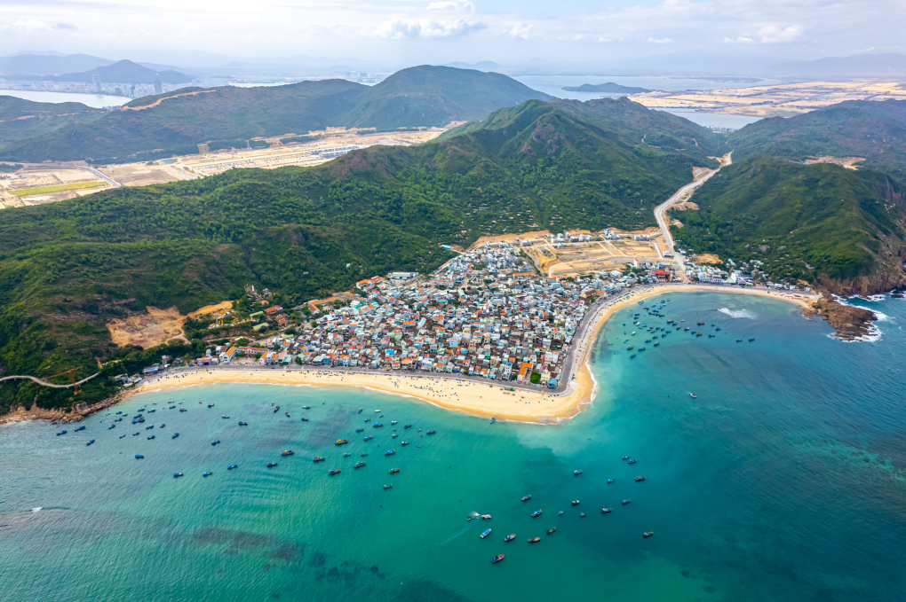
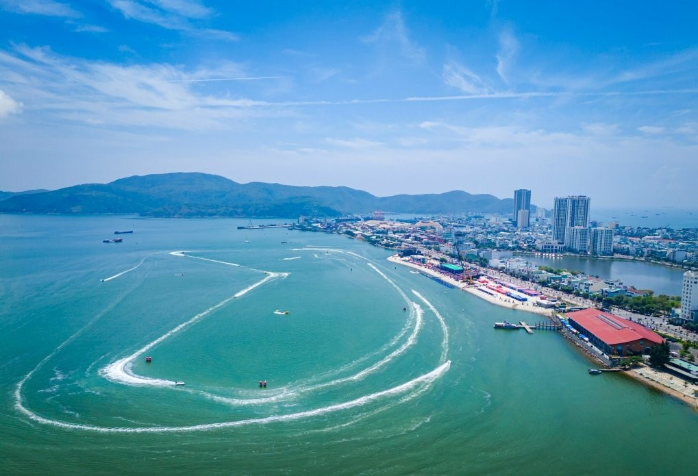

Phố biển Quy Nhơn được thiên nhiên ưu ái, hạ tầng du lịch hoàn thiện, là điểm đến hàng đầu cho các sự kiện du lịch, thể thao quy mô quốc tế.
Là "trái tim" của Bình Định, Quy Nhơn được xem một trong những điểm đến hàng đầu của miền Trung với hàng chục bãi biển đẹp, cảnh quan kỳ thù, văn hóa, ẩm thực đặc sắc. Địa phương đang trên đường xây dựng thương hiệu "thiên đường du lịch biển", đồng thời muốn thu hút du khách qua các hoạt động thể thao tầm cỡ quốc gia, quốc tế.

**Trải nghiệm du lịch đa dạng**

Quy Nhơn nép mình giữa một bên biển một bên núi với những bờ biển dài uốn cong thơ mộng, bờ cát vàng mịn và làn nước trong xanh đẹp mê hồn. Từ khắp nơi trong thành phố, du khách có thể ngắm nhìn những bãi biển xanh ngắt, tận hưởng gió trời.

#### _Một góc làng chài Nhơn Hải_

Quanh thành phố là hàng chục bãi biển thu hút hàng triệu lượt khách mỗi năm. Nhơn Hải - Hòn Khô là điểm đến nổi tiếng nhờ vào cảnh đẹp hoang sơ và con người thật thà, chất phác. Từ làng chài Nhơn Hải du khách đón cano hoặc tàu ra Hòn Khô chỉ khoảng 10 phút với chi phí khứ hồi từ 100.000 đồng một người. Cách đó không xa là Kỳ Co, được nhiều người ví như Maldives Việt Nam. Du khách có thể lặn ngắm san hô, thuê chòi thư giãn bên bờ biển, chơi moto nước, dù kéo, cắm lều trại hoặc nghỉ tại khách sạn ngay trong khu du lịch. Sát Kỳ Co là Eo Gió, nơi có con đường đi bộ ôm theo sườn núi và view biển đẹp ngoạn mục.

Nối dài chuỗi địa danh du lịch biển ở Quy Nhơn còn có Bãi Xép, khu vực có nhiều rặng đá tự nhiên nổi lên trên mặt nước, bờ cát vàng mịn màng thu hút nhiều bạn trẻ chụp hình. Bãi Xép yên bình. Du khách đến đây vừa tắm biển, vừa có thể khám phá đời sống của người dân làng chài, lưu trú trong các homestay bình dân. Nếu vừa muốn du lịch biển vừa tìm hiểu văn hóa bản địa, du khách có thể chọn Nhơn Lý. Đây là một xã bán đảo vẫn còn lưu giữ nhiều di tích của văn hóa Champa. Làng chài còn thu hút khách thập phương với sắc màu từ những bức tranh bích họa.

#### _Quy Nhơn lúc bình minh._

Quy Nhơn cũng không thiếu những sản phẩm du lịch văn hóa, tâm linh. Khách đến đây có thể chọn ghé thăm các tháp Chăm, nhiều ngôi chùa lớn như Long Phước (cái nôi của võ cổ truyền), chùa Núi với bức tượng Phật ngồi khổng lồ. Một trải nghiệm du lịch độc đáo khác khi đến thành phố là khám phá thiên văn học với các tour tìm hiểu vũ trụ, ngắm vũ trụ đêm tại Trung tâm Khám phá khoa học và Đổi mới sáng tạo.

Với ẩm thực, địa phương làm xiêu lòng khách thập phương với rất nhiều đặc sản. Đến Quy Nhơn phải thử bánh hỏi cháo lòng, bánh xèo tôm nhảy, bánh ít lá gai, chả ram, nem nướng, hải sản. Mức giá tại đây vừa phải. Chính quyền thường xuyên nhắc nhở, kiểm tra việc kinh doanh nên du khách an tâm về giá.

**Điểm đến của những giải thể thao**

Không chỉ phát triển du lịch biển, thời gian qua Bình Định và Quy Nhơn chú trọng đến du lịch thể thao với các bộ môn như võ cổ truyền, du lịch golf, bóng chuyền bãi biển, marathon để thu hút du khách trong và ngoài nước.

Ông Lâm Hải Giang - Phó Chủ tịch tỉnh Bình Định cho biết các quốc gia trên thế giới đang tận dụng cơ hội đăng cai các giải thể thao để tạo dựng hình ảnh đất nước và phát triển du lịch, dịch vụ. Bình Định cũng định hướng phát triển du lịch, quảng bá hình ảnh theo mô hình này.

#### _Đua motor nước trên đầm Thị Nại_

Với lợi thế về mặt nước, cảnh quan biển đa dạng, Quy Nhơn, thời gian qua đã đăng cai tổ chức thành công Giải đua Thuyền buồm Quốc tế và Ván chèo đứng Quy Nhơn. Mới nhất, Quy Nhơn tiếp tục thành chủ nhà của Giải đua thuyền máy nhà nghề quốc tế UIM F1H20 và UIM-ABP Aquabike Bình Định Grand Prix 2024, tổ chức trên đầm Thị Nại. Các giải thể thao biển này thu hút VĐV từ hàng chục quốc gia, kéo hàng nghìn lượt du khách đến thủ phủ du lịch biển miền Trung.

Tiếp tục nối dài các sự kiện du lịch thể thao, Lễ hội du lịch Bình Định năm 2024, với chủ đề "Quy Nhơn – Thiên đường biển – Tỏa sáng phát triển" sẽ bắt đầu từ tháng 6 để đón mùa cao mùa cao điểm du lịch hè. Xuyên suốt mùa hè, địa phương sẽ tổ chức tổng cộng 22 sự kiện văn hóa, thể thao.
