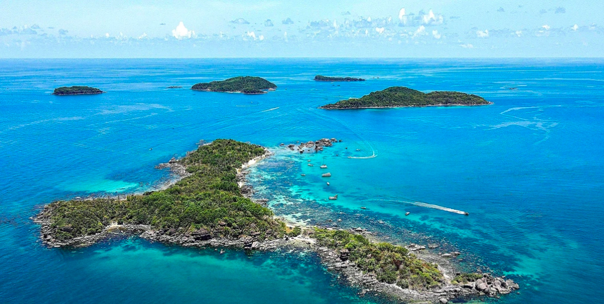
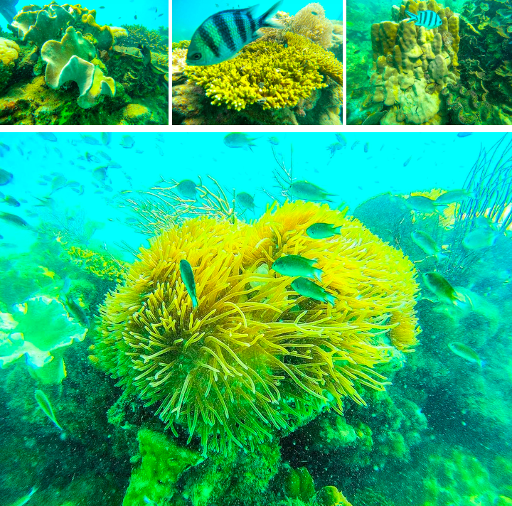
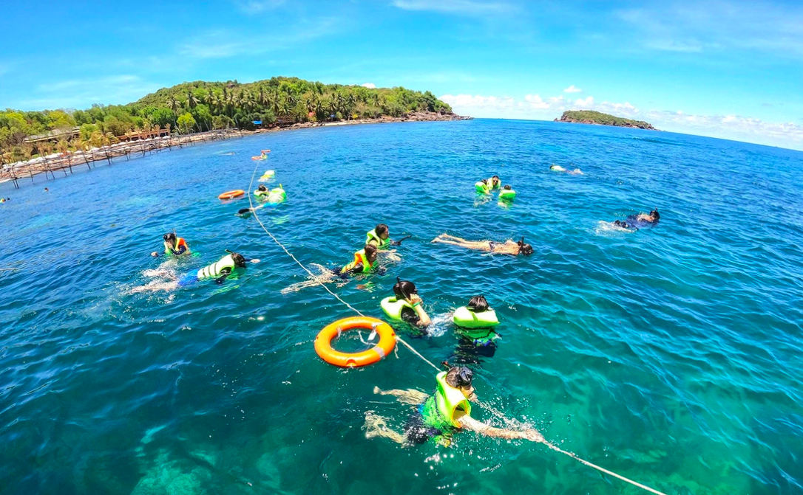

#### _Khu vực biển xung quanh các hòn phía Nam đảo Phú Quốc hoang sơ với nhiều rạn san hô tuyệt đẹp_

Vùng biển cạn xung quanh các hòn đảo này có nhiều rạn san hô đẹp, cá biển lạ với nhiều sắc màu thu hút du khách trải nghiệm, khám phá.
Những loài san hô phổ biến, tuyệt đẹp nhất ở vùng biển này có thể kể như: san hô bàn, san hô não, san hô nhánh, san hô nấm, san hô cành dương hồng, san hô bong bóng, san hô ngón tay, san hô khối đầu thùy, san hô quạt biển, san hô tổ ong… Lặn biển, khám phá "thủy cung" trong lòng đại dương, du khách còn bất ngờ vì những đàn cá dạn dĩ vây quanh. Vùng biển này có khoảng 135 loài cá sinh sống tại các rạn san hô.

#### _San hô ở vùng biển Phú Quốc phát triển tốt nhất ở vùng biển cạn từ 3-5m, nước trong, nhiều ánh sáng_

Theo người dân địa phương, san hô ở vùng biển phía Nam đảo Phú Quốc đẹp nhất ở xung quanh hòn Mây Rút Ngoài, hòn Gầm Ghì. "Đây là lần đầu tiên tôi được đi bộ dưới đáy biển và tham quan san hô cùng các loài cá biển. Mọi thứ đẹp như một bức tranh mà trước đây tôi chỉ thấy trên sách, báo hoặc tivi. Tôi nghĩ hệ sinh thái đặc trưng này là một tài sản tự nhiên quý giá, rất cần được bảo tồn, trân trọng", chị Nguyễn Lê Lan, du khách TP.HCM, chia sẻ.

#### _Hòn Gầm Ghì trong xanh với rạn san hô trải dài thu hút nhiều du khách_

Theo Sở Khoa học và Công nghệ Kiên Giang, vùng biển Phú Quốc có khoảng 108 loài san hô, phân bố nhiều tại khu vực biển cạn ven bờ phía Nam đảo Phú Quốc. Do môi trường biển phù hợp, diện tích san hô ở Phú Quốc được duy trì khá ổn định theo từng năm. Thời gian qua, ngành chức năng, người dân, du khách có ý thức khá tốt trong việc bảo vệ những rạn san hô.

Khách du lịch vào ngày cuối tuần ưu tiên chọn Phú Quốc làm điểm đến nghỉ dưỡng lý tưởng.
