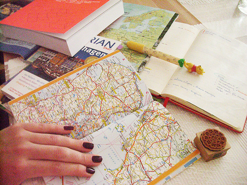

**Lập Kế Hoạch Trước **

Lập kế hoạch trước cho chuyến đi của bạn là một trong những cách hiệu quả nhất để
tiết kiệm tiền. Bạn có thể tìm hiểu về các ưu đãi, khuyến mãi, và giảm giá từ các
trang web đặt phòng khách sạn hoặc vé máy bay. Đặt vé sớm càng tốt để có được giá
tốt nhất.

**Lựa Chọn Đúng Thời Gian**

Thời điểm bạn lên kế hoạch du lịch cũng có ảnh hưởng lớn đến giá cả. Tránh những mùa du lịch cao điểm và các ngày lễ lớn khi giá cả thường tăng cao. Thay vào đó, hãy cân nhắc chọn thời gian đi trong các mùa du lịch thấp điểm hoặc giữa tuần để nhận được giá ưu đãi.

**Tận Dụng Ưu Đãi**

Khám phá và tận dụng các ưu đãi và khuyến mãi là cách thông minh để tiết kiệm tiền trong chuyến du lịch của bạn. Sử dụng các ứng dụng và trang web như Groupon hoặc LivingSocial để mua vé giảm giá cho các hoạt động giải trí, nhà hàng, và tour du lịch. Ngoài ra, không quên kiểm tra các gói combo hoặc vé kết hợp cho nhiều hoạt động để tiết kiệm thời gian và tiền bạc.

**Lựa Chọn Chỗ Ở Thông Minh**

Thay vì đặt phòng khách sạn, bạn có thể xem xét các phương án chỗ ở khác như Airbnb, homestay, hoặc hostel. Đây thường là các lựa chọn tiết kiệm hơn và còn cho phép bạn trải nghiệm cuộc sống địa phương hơn.

**Sử Dụng Phương Tiện Công Cộng**

Tránh thuê xe hơi nếu có thể và thay vào đó sử dụng phương tiện công cộng. Việc di
chuyển bằng xe buýt, tàu hỏa, hoặc đi bộ không chỉ giúp bạn tiết kiệm tiền mà còn
giúp bạn khám phá thành phố từ góc độ khác.

**Thưởng Thức Ẩm Thực Địa Phương**

Thay vì ăn tại các nhà hàng du lịch đắt đỏ, hãy thử ẩm thực địa phương tại các quán ăn nhỏ, hàng quán đường phố. Đây không chỉ là cách tiết kiệm tiền mà còn giúp bạn trải nghiệm hương vị độc đáo của địa phương.

**Điều Chỉnh Kế Hoạch Nếu Cần**

Cuối cùng, hãy linh hoạt và sẵn lòng điều chỉnh kế hoạch của mình nếu cần. Đôi khi, việc thay đổi kế hoạch du lịch có thể mang lại những trải nghiệm bất ngờ và thú vị mà không làm tổn thương ngân sách của bạn.

Dù bạn đang lên kế hoạch cho một chuyến du lịch xa hoặc một kỳ nghỉ ngắn ngày, việc áp dụng những mẹo tiết kiệm thông minh này sẽ giúp bạn tận hưởng trải nghiệm du lịch mà không cần phải lo lắng về tài chính. Hãy nhớ rằng không phải mọi khoản chi phí đều phải đắt đỏ để có một kỳ nghỉ ý nghĩa và đáng nhớ!
