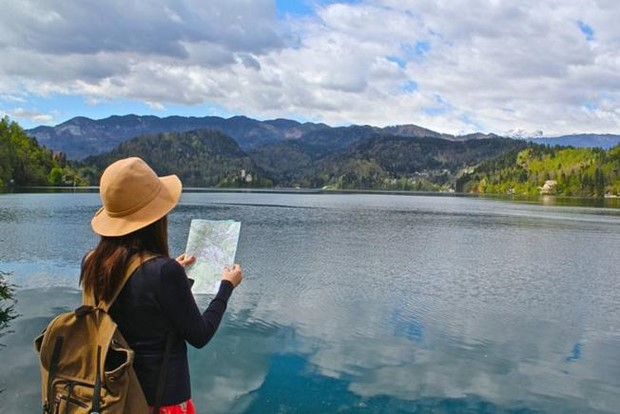

**Lập Kế Hoạch Trước**

Việc lập kế hoạch trước là chìa khóa thành công cho một chuyến đi tự túc. Trước khi bắt đầu, hãy nghiên cứu về địa điểm bạn muốn đến, bao gồm văn hóa địa phương, thời tiết, giá cả, và cách di chuyển. Lên một lịch trình linh hoạt và chi tiết sẽ giúp bạn tận dụng thời gian hiệu quả và tránh bất kỳ rắc rối nào.

**Tìm Hiểu Về Điểm Đến**

Trước khi đi, hãy nghiên cứu kỹ về địa điểm bạn sắp đến. Tìm hiểu về văn hóa, lịch
sử, ngôn ngữ và phong cảnh địa phương sẽ giúp bạn có trải nghiệm du lịch sâu sắc
và ý nghĩa hơn. Đồng thời, hãy tham khảo các địa điểm nổi tiếng và những điểm đến
bí mật ít người biết để có trải nghiệm độc đáo. Hãy Linh Hoạt

Trong khi lập kế hoạch là quan trọng, việc linh hoạt cũng là điều không thể thiếu khi du lịch tự túc. Đôi khi, các kế hoạch có thể thay đổi hoặc có những bất ngờ không lường trước. Hãy sẵn lòng thích nghi và điều chỉnh lịch trình của bạn để tận hưởng mọi trải nghiệm mà du lịch mang lại.

**Giao Tiếp và Giao Lưu**

Khả năng giao tiếp là yếu tố quan trọng trong mỗi chuyến đi, đặc biệt là khi du lịch tự túc. Hãy học một vài câu cơ bản trong ngôn ngữ địa phương để giao tiếp với người dân địa phương và nhận được sự giúp đỡ khi cần thiết. Đồng thời, hãy mở lòng và sẵn sàng giao lưu với người mới để trải nghiệm văn hóa địa phương một cách chân thành.

**Bảo Vệ Bản Thân và Tài Sản**

An toàn luôn là ưu tiên hàng đầu khi du lịch. Hãy luôn giữ an toàn cho bản thân và tài sản của bạn bằng cách luôn để ý đến môi trường xung quanh, tránh những nơi nguy hiểm và giữ các giấy tờ quan trọng và tiền mặt ở nơi an toàn.
Nhớ Lưu Giữ Kỷ Niệm

Cuối cùng, hãy nhớ lưu giữ những khoảnh khắc đáng nhớ của chuyến đi bằng cách chụp hình, ghi chép hoặc quay video. Những kỷ niệm này sẽ là kho báu mà bạn có thể khám phá lại sau này và chia sẻ với người thân và bạn bè.

Du lịch tự túc lần đầu có thể đầy thách thức nhưng cũng là cơ hội để khám phá và trải nghiệm một cách tự do và độc lập. Với những kinh nghiệm và lời khuyên trên, bạn có thể tự tin bước vào cuộc hành trình mới mẻ và đầy ý nghĩa. Chúc bạn có một chuyến đi tuyệt vời!
