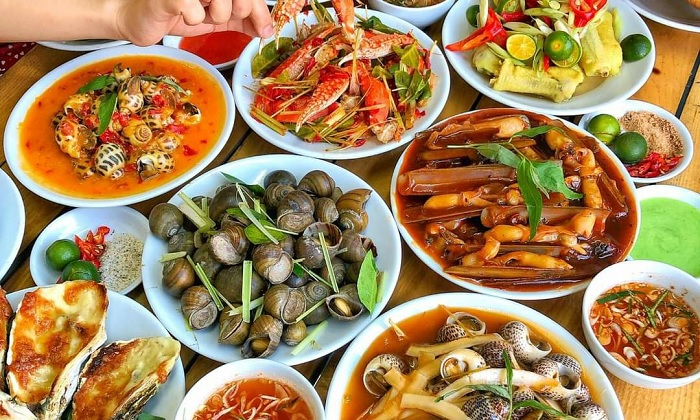
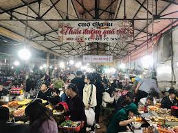

**1. Nghiên cứu trước**

Trước khi bắt đầu chuyến đi, hãy dành thời gian để nghiên cứu về văn hóa ẩm thực của địa phương bạn sẽ đến. Tìm hiểu về những món ăn nổi tiếng, các quán ăn địa phương và đặc biệt là những món ăn đặc sản bạn không thể bỏ qua. Việc này giúp bạn có kế hoạch ăn uống hợp lý và tránh bỏ lỡ những món ngon.

**2. Thử những món mới**

Đừng ngần ngại thử những món ăn mới. Chuyến đi là cơ hội tốt để mở rộng khẩu vị của bạn và khám phá những hương vị mới lạ. Hãy tận hưởng những trải nghiệm ẩm thực độc đáo mà địa phương đem lại.

**3. Thăm chợ địa phương**

Chợ địa phương thường là nơi tập trung các món ăn đặc sản và nguyên liệu tươi ngon. Dành thời gian để thăm chợ, tương tác với người dân địa phương và thưởng thức những món ăn địa phương hấp dẫn.

**4. Tham gia tour ẩm thực**

Nếu bạn muốn có một trải nghiệm ẩm thực chuyên sâu và được hướng dẫn bởi những chuyên gia, hãy tham gia các tour ẩm thực cung cấp tại địa điểm du lịch. Điều này giúp bạn khám phá những địa điểm ẩm thực phong phú và có cơ hội học hỏi từ những người am hiểu về ẩm thực địa phương.

**5. Đi theo nhóm**

Ăn cùng nhóm bạn hoặc gia đình sẽ tạo ra không khí vui vẻ và giúp bạn thử nhiều món
ăn hơn. Bạn cũng có thể chia sẻ và so sánh các trải nghiệm của mình, tạo ra những
kỷ niệm đáng nhớ.

** 6. Chú ý đến vệ sinh an toàn thực phẩm**

Đảm bảo rằng những nơi bạn chọn để ăn đều đảm bảo vệ sinh và an toàn thực phẩm. Tránh ăn ở những nơi có dấu hiệu không sạch sẽ hoặc không an toàn để đảm bảo sức khỏe của bạn.

**7. Thử ăn đường phố**

Khám phá văn hóa ẩm thực địa phương bằng cách thử các món ăn đường phố. Đây thường là những món ăn ngon và giá cả phải chăng, đồng thời cũng giúp bạn trải nghiệm văn hóa địa phương một cách độc đáo.

**8. Ghi chú và chụp hình**

Ghi chú lại những món ăn bạn thích và chụp hình để lưu giữ những khoảnh khắc đáng nhớ của chuyến đi ẩm thực của bạn. Những hình ảnh và ghi chú này sẽ giúp bạn nhớ mãi những hương vị và trải nghiệm thú vị trong chuyến food tour của mình.

Với những bí quyết trên, hy vọng bạn sẽ có một chuyến food tour đầy hấp dẫn và đáng nhớ. Chúc bạn thưởng thức những hương vị độc đáo và trải nghiệm văn hóa ẩm thực đích thực!
