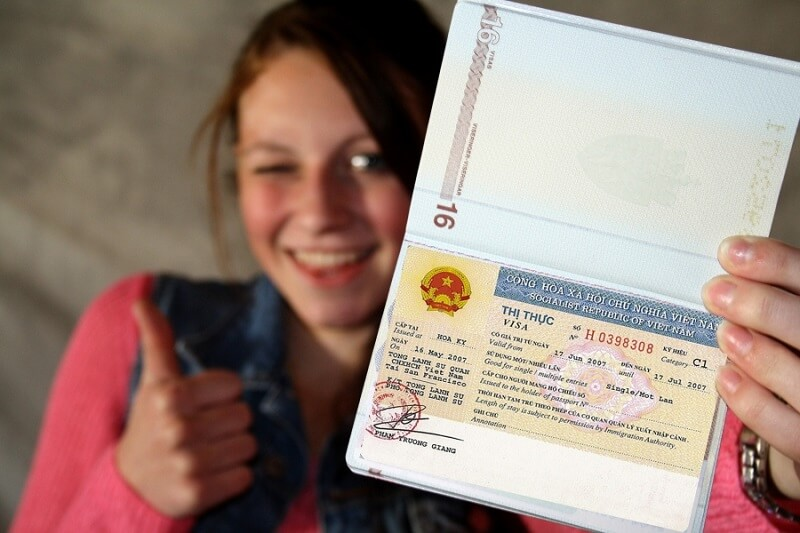
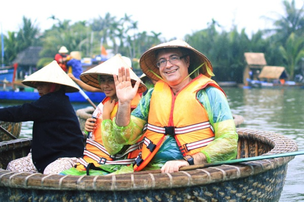

**1. Thời Tiết và Mùa Đi Lý Tưởng**

Việt Nam có hai mùa lớn: mùa khô và mùa mưa. Mùa khô diễn ra từ tháng 11 đến tháng 4, trong khi mùa mưa bắt đầu từ tháng 5 đến tháng 10. Mỗi mùa có những đặc điểm riêng, vì vậy bạn nên lựa chọn thời gian đi dựa trên các hoạt động du lịch mà bạn muốn trải nghiệm.

**2. Visa và Thủ Tục Nhập Cảnh**

Trước khi đến Việt Nam, hãy đảm bảo rằng bạn đã có visa hoặc thị thực phù hợp. Thủ tục nhập cảnh có thể khá đơn giản, nhưng việc chuẩn bị trước sẽ giúp bạn tránh được những rắc rối không cần thiết.

**3. Giao Thức Xã Hội và Văn Hóa**

Trong văn hóa Việt Nam, sự lễ phép và tôn trọng rất quan trọng. Khi giao tiếp với người địa phương, hãy nhớ giữ phong cách lịch sự và tránh gây xúc phạm. Một số điều như ăn mặc lịch sự khi thăm đền chùa và không chạm vào đầu của người khác cũng là điều cần lưu ý.

**4. An Toàn và Sức Khỏe**

Trước khi đi du lịch, hãy đảm bảo rằng bạn đã có các loại vắc xin cần thiết và mua bảo hiểm du lịch. Nước uống đóng chai là lựa chọn an toàn nhất để tránh vi khuẩn đường ruột. Bạn cũng nên mang theo thuốc phòng tránh và điều trị bệnh.

**5. Giao Thông và An Toàn**

Giao thông tại Việt Nam có thể rất hỗn độn với nhiều phương tiện giao thông cùng tồn tại. Khi di chuyển, hãy luôn chú ý và cẩn thận, đặc biệt là khi băng qua đường. Việc thuê xe máy cũng là một lựa chọn phổ biến, nhưng hãy đảm bảo rằng bạn có bằng lái phù hợp và tuân thủ luật giao thông.

**6. Tiền Tệ và Thanh Toán**

Tiền tệ chính thức của Việt Nam là đồng Việt Nam (VND), nhưng nhiều địa điểm cũng chấp nhận thanh toán bằng tiền mặt ngoại tệ như USD hoặc thẻ tín dụng quốc tế. Tuy nhiên, luôn nên mang một số lượng nhỏ đồng tiền địa phương để thanh toán cho các giao dịch nhỏ.
Việt Nam là một đất nước đa dạng và thú vị, đầy rẫy những trải nghiệm đặc biệt đang chờ đón du khách khám phá. Với những lời khuyên trên, hy vọng bạn sẽ có một chuyến du lịch tuyệt vời và đầy những kỷ niệm khó quên tại Việt Nam. Chúc bạn có một kỳ nghỉ thú vị!
