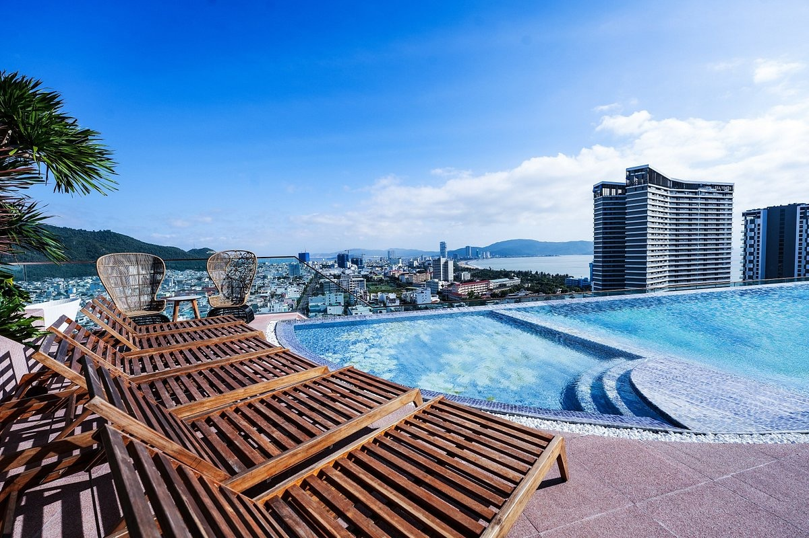
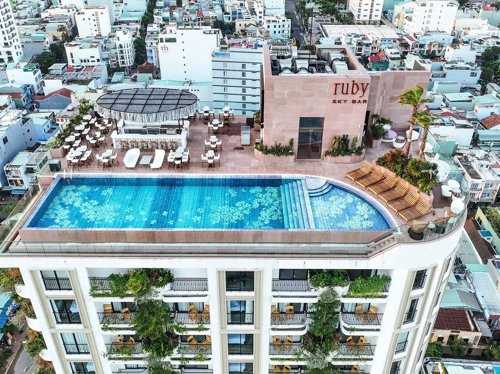
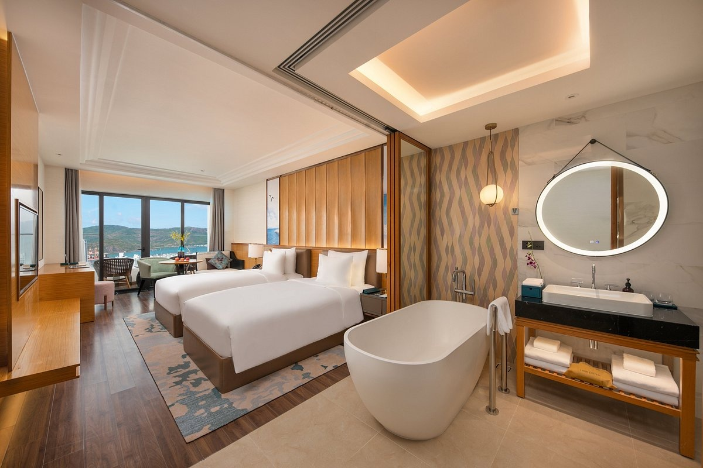
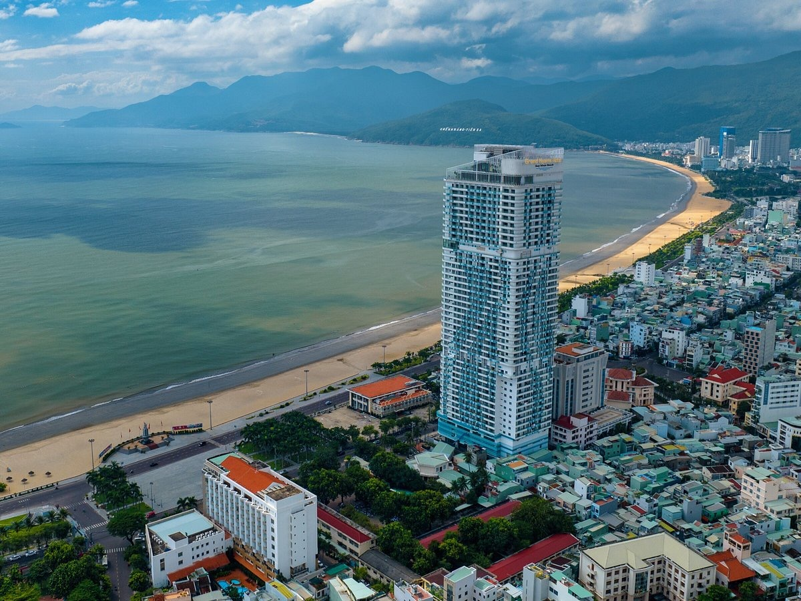
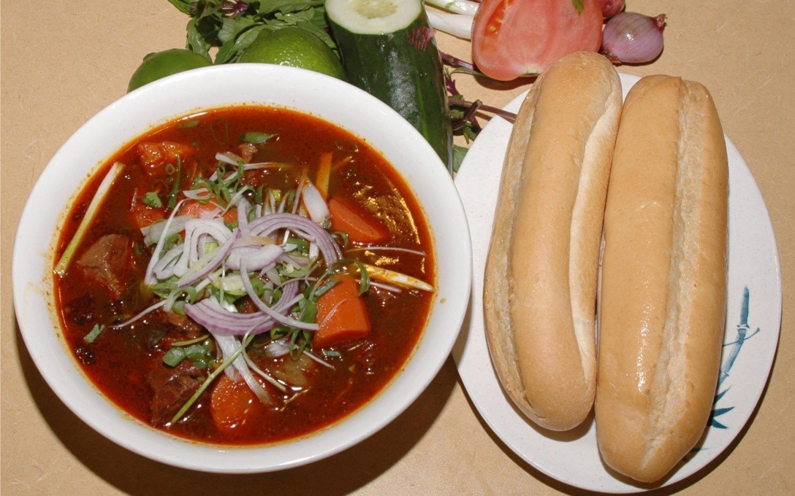
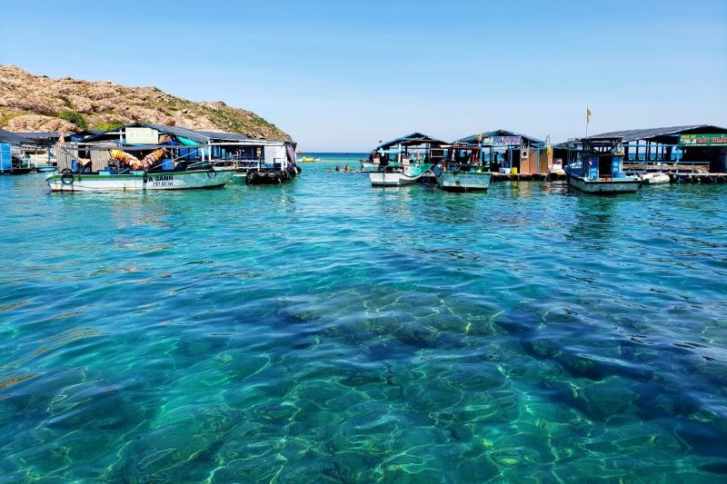

Thành phố biển của tỉnh Bình Định, nằm trong khu vực duyên hải Nam Trung Bộ, Quy Nhơn đang thu hút sự chú ý của du khách với vẻ đẹp hoang sơ và hấp dẫn. Với khoảng cách không xa, cách Hà Nội 1.065 km và cách TP HCM 650 km, Quy Nhơn trở thành điểm đến lý tưởng cho những chuyến du lịch.

Nằm nép mình giữa một bên là biển cả xanh thẳm, một bên là dãy núi non bao quanh, Quy Nhơn mang đến cho du khách những bờ biển dài uốn cong thơ mộng, với bờ cát vàng mịn và làn nước trong xanh đẹp mê hồn. Khám phá Quy Nhơn không chỉ được tận hưởng vẻ đẹp tự nhiên tuyệt vời mà còn là cơ hội trải nghiệm văn hóa và con người địa phương tận tâm và thân thiện.

Nên đến Quy Nhơn vào mùa nào?
Mùa nào ở Quy Nhơn cũng đẹp và thuận lợi cho việc du lịch. Mùa mưa chỉ kéo dài khoảng 2-3 tháng cuối năm, trong khi thời gian còn lại trong năm, tiết trời ở Quy Nhơn khá khô ráo, đặc biệt từ tháng 3 đến 9. Mùa hè, từ tháng 5 đến 9, nắng không quá oi bức, không bị ảnh hưởng bởi mưa bão, tạo điều kiện lý tưởng cho du khách tham gia các hoạt động vui chơi, giải trí trên bờ biển và dưới biển.

#### _Biển Quy Nhơn (Ảnh: Sưu tầm)_

**Di chuyển**

Di chuyển đến Quy Nhơn ngày nay rất thuận tiện với các hãng hàng không như Vietnam Airlines, Vietjet Air và Bamboo Airways khai thác tuyến bay từ Hà Nội và TP HCM đến sân bay Phù Cát. Giá vé khứ hồi dao động từ khoảng 1.500.000 đến 4.000.000 đồng một người, tùy thuộc vào thời điểm và hãng hàng không.

Sau khi đến sân bay Phù Cát, du khách có nhiều phương tiện di chuyển khác nhau để đến trung tâm thành phố Quy Nhơn. Có thể đi xe buýt với giá 50.000 đồng một người, hoặc thuê taxi với giá khoảng 200.000 - 250.000 đồng một chuyến. Ngoài ra, du khách cũng có thể sử dụng các phương tiện di chuyển bộ như ôtô khách hoặc tàu hỏa từ các tỉnh lân cận.

**Nơi ở**

Trong thành phố, du khách có nhiều lựa chọn về chỗ ở, từ homestay, hostel đến các khách sạn 2-3 sao với giá từ 150.000 - 400.000 đồng một đêm. Các khách sạn tại các con đường như Tây Sơn, An Dương Vương, Hàn Mặc Tử cung cấp không chỉ sự thoải mái mà còn tiện ích và yên tĩnh. Nếu muốn ở gần biển, du khách có thể tìm tới các con đường như Nguyễn Huệ, Xuân Diệu, hoặc các khu vực như Bãi Xép, Kỳ Co, Eo Gió.

#### _Các khách sạn, homestay tại Quy Nhơn (Ảnh: Sưu tầm)_

**Ăn uống**

Về ẩm thực, Quy Nhơn không chỉ là thiên đường của hải sản tươi ngon mà còn có nhiều món ăn đặc sản hấp dẫn. Du khách có thể thưởng thức bánh canh chả cá, bánh xèo tôm nhảy, bánh hỏi cháo lòng, nem nướng, bánh mì lagu, bánh khọt tôm mực và nhiều món ăn khác. Các quán ăn tại Quy Nhơn cung cấp không chỉ những món ăn ngon mà còn không gian thoải mái và giá cả phải chăng, như Phố ốc Ngọc Hân Công Chúa, Bánh mì lagu tại số 132 Ngô Mây, hay nhà hàng Bếp Nhà 1989.

#### _Bánh khọt tôm mực (Ảnh: Sưu tầm)_

#### _Bánh mì Lagu (Ảnh: Sưu tầm)_

#### _Bánh hỏi cháo lòng (Ảnh: Sưu tầm)_

**Điểm đến thú vị**

Không chỉ là điểm đến của những người yêu biển, Quy Nhơn còn có nhiều điểm tham quan độc đáo và thú vị. Các địa điểm như Hòn Khô và làng chài Nhơn Hải mang đến cho du khách những trải nghiệm hoang sơ và gần gũi với thiên nhiên. Kỳ Co và Eo Gió nổi tiếng với vẻ đẹp hoang sơ, bãi biển trong xanh và nước biển trong veo. Cảnh đẹp tự nhiên kết hợp với các hoạt động giải trí như lặn ngắm san hô, cắm trại, dù lượn, cũng như ẩm thực hải sản độc đáo tại các quán ăn ven biển khiến du khách không thể quên.

#### _Làng chài Nhơn Hải (Ảnh: Sưu tầm)_

#### _Du khách check-in tại Kỳ Co - Eo Gió (Ảnh: Sưu tầm)_

Với những điều đặc biệt và hấp dẫn như vậy, Quy Nhơn đang trở thành điểm đến yêu thích của rất nhiều du khách, không chỉ trong nước mà còn quốc tế. Đến với Quy Nhơn, du khách không chỉ được trải nghiệm vẻ đẹp hoang sơ của thiên nhiên mà còn được khám phá văn hóa, con người và ẩm thực độc đáo của vùng đất duyên hải Nam Trung Bộ.
