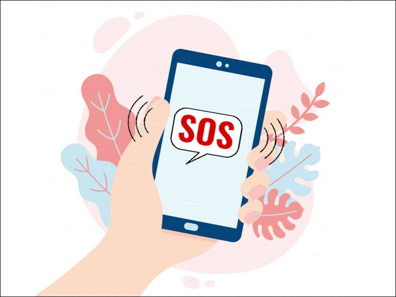
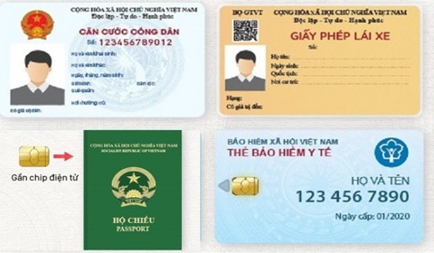

**1. Thông báo kế hoạch cho người thân**
Một trong những kinh nghiệm quý báu của du khách đi một mình là thông báo cho người thân về kế hoạch du lịch của mình. Hãy ghi chép cẩn thận các điểm đến và lịch trình dự kiến của bạn. Đặc biệt, hãy lưu lại số điện thoại của nhiều người thân để sẵn sàng trong trường hợp khẩn cấp.

*Biển Quy Nhơn*{' '}

**2. Tìm hiểu văn hóa vùng miền của nơi bạn đến **

Khi lên kế hoạch cho chuyến du lịch một mình, câu hỏi về đích đến thường là điều đầu tiên bạn cần suy nghĩ. Mỗi địa điểm mang theo nền văn hóa và quy định riêng biệt, đặc biệt là ở những khu vực du lịch và giải trí. Việc chuẩn bị kỹ lưỡng trước khi đi du lịch một mình là vô cùng quan trọng. Điều này bao gồm việc tìm hiểu kỹ về địa điểm bạn sẽ đến.

Sự hòa nhập vào cuộc sống địa phương là chìa khóa để có một chuyến đi du lịch thú vị và thoải mái. Hiểu biết về tập quán và phong tục địa phương không chỉ giúp bạn trải nghiệm sâu sắc hơn mà còn mở rộng kiến thức địa lý và làm phong phú kỹ năng sinh tồn của bạn trong trường hợp gặp khó khăn.

**3. Giữ gìn cẩn thận đồ cá nhân**

Khi du lịch một mình, bảo vệ tài sản cá nhân là một trong những vấn đề quan trọng nhất mà bạn cần chú ý. Đặc biệt khi đến những vùng đất xa lạ, nơi mà bạn không quen biết, nguy cơ mất vật dụng có giá trị là rất cao. Do đó, việc quản lý và bảo vệ tài sản cá nhân luôn được ưu tiên hàng đầu.

Việc mất đồ không chỉ gây khó khăn trong việc tham quan và di chuyển mà còn đặt ra nguy cơ không thể trở về nhà. Nếu bạn mất tài sản, bạn sẽ gặp khó khăn về mặt tài chính và cũng sẽ mất đi sự thuận tiện trong quá trình di chuyển trên hành trình của mình.

**4. Không đi tới nơi vắng vào ban đêm**

Khi du lịch một mình, điều quan trọng bạn cần lưu ý là tránh những nơi hoang vắng vào ban đêm. Tại những vùng đất xa lạ, đặc biệt là khi cảnh báo về nguy cơ cướp giật, móc túi ngày càng tăng cao, việc bảo đảm an toàn cho bản thân trở nên vô cùng quan trọng.

**5. Học vài câu tiếng địa phương đơn giản**

Trước khi bắt đầu hành trình du lịch, ngoài việc chuẩn bị các vật dụng cá nhân cần thiết, bạn cũng nên tìm hiểu về văn hóa địa phương. Đặc biệt, nếu đích đến của bạn sử dụng ngôn ngữ khác, hãy học một số cụm từ cơ bản như "Xin chào" hoặc "Hỏi đường". Việc sử dụng ngôn ngữ địa phương sẽ giúp bạn giao tiếp dễ dàng hơn và tạo sự gần gũi hơn với người dân địa phương, làm cho chuyến đi của bạn trở nên ý nghĩa hơn.

**6. Luôn giữ tinh thần cảnh giác**
Tâm lý của người du lịch một mình thường trở nên lo lắng và e ngại khi đặt chân vào môi trường mới lạ và hoang sơ. Tuy nhiên, đây cũng là cơ hội cho những kẻ xấu tiến gần bạn. Vì thế, luôn giữ tinh thần cảnh giác và tự tin là điều quan trọng để tránh gây sự chú ý cho những người có ý định xấu.

**7. Tìm kiếm thông tin từ nhân viên khách sạn**
Mặc dù đã chuẩn bị kỹ lưỡng trước khi đi du lịch, nhưng khi đặt chân đến điểm đến, việc hỏi thông tin từ nhân viên khách sạn vẫn là một cách thông minh để tránh những bất tiện không mong muốn. Lưu ý nên hỏi một cách chi tiết và nếu cần, bạn có thể ghi âm lại để tránh bối rối khi đi tham quan một mình.

**8. Chuẩn bị bản sao của các giấy tờ quan trọng**

Mất những giấy tờ quan trọng như hộ chiếu có thể khiến bạn cảm thấy như trời đất sụp đổ. Việc này không chỉ gây trở ngại trong việc tiếp tục hành trình mà còn làm cho việc trở về nước trở nên khó khăn hơn. Vì vậy, việc lưu giữ bản sao của những giấy tờ cần thiết trở nên cực kỳ quan trọng.

Bản photocopy của hộ chiếu, chứng minh thư hoặc các giấy tờ khác, thậm chí là ảnh chụp của chúng trên điện thoại hoặc máy tính xách tay, đều có thể trở thành một giải pháp cứu cánh. Những bản sao này không chỉ hỗ trợ trong việc xin cấp lại hộ chiếu mà còn giúp bạn xác nhận thân phận với các cơ quan chức năng địa phương, giúp họ dễ dàng hỗ trợ bạn trong trường hợp cần thiết.

**9. Đừng lúc nào cũng đeo headphone**

Bạn có thói quen đeo tai nghe khi di chuyển trên xe buýt, đợi máy bay, hoặc thậm chí khi đi dạo trong thành phố không? Mặc dù việc này có thể mang lại cho bạn những phút giây thư giãn, tận hưởng âm nhạc và suy nghĩ riêng tư, nhưng đôi khi bạn có thể quá tập trung vào âm nhạc mà quên mất xung quanh. Điều này khiến cho bạn trở nên mất cảnh giác và mất tập trung vào môi trường xung quanh. Đối với phụ nữ đi du lịch một mình, việc luôn giữ sự chú ý và cảnh giác với môi trường xung quanh là điều quan trọng nhất.

**10. Không say sỉn**
Đồ uống có cồn mang theo hai mặt, nó có thể làm cho buổi tiệc trở nên vui vẻ hơn nhưng cũng có thể đưa bạn vào tình huống nguy hiểm. Việc uống một chút để thư giãn cùng bạn bè mới là điều thú vị, nhưng việc uống quá đà có thể dẫn đến hậu quả không mong muốn. Dù đang tham gia vào một bữa tiệc sôi động, nhớ rằng bạn vẫn đang ở một mình trong một nơi xa lạ. Hãy uống một cách có chừng mực, biết giữ khoảng cách và luôn giữ cho tâm trí tỉnh táo, đủ nhận biết được môi trường xung quanh. Nếu bạn cảm thấy bắt đầu cảm thấy mơ mộng và có ai đó tiếp cận bạn, hãy rời khỏi đó và tìm đến một nơi an toàn. Nếu bạn đang ở trong một quán bar hoặc nightclub, hãy yêu cầu sự giúp đỡ từ những người làm việc tại đó, vì họ thường quen thuộc với các tình huống như vậy. Bartender hoặc nhân viên phục vụ có thể hỗ trợ gọi bảo vệ để đảm bảo an toàn cho bạn.
Hãy nhớ rằng, việc mất kiểm soát vì say xỉn là điều cấm kị đối với người du lịch một mình. Điều này có thể dẫn đến những tình huống nguy hiểm nhất trong hành trình của bạn.

**11. Bạn không bao giờ một mình**
Ý nghĩ du lịch solo sẽ là trải nghiệm buồn chán là một quan điểm sai lầm. Trên thực tế, bạn sẽ có cơ hội gặp gỡ và kết bạn với nhiều người mới trong suốt hành trình của mình. Bạn sẽ được trải nghiệm những điều mới mẻ, chia sẻ câu chuyện và kỷ niệm với những người bạn mới quen. Đến lúc đó, bạn có thể mong chờ những khoảnh khắc yên bình để thưởng thức cảm giác của không gian riêng tư.

Tuy nhiên, không nên nói chuyện nhiều với những người lạ khi bạn đang du lịch một mình. Nếu bạn cảm thấy không thoải mái với ai đó tiếp cận, hãy sử dụng những câu nói như: "Xin lỗi, tôi đã có cuộc hẹn sắp tới", hoặc "Bạn trai/ bạn gái của tôi ra ngoài một chút, anh/ cô ấy sẽ trở lại sớm thôi". Đó không phải là sự hoang tưởng, nhưng đôi khi bạn cần làm vậy để đảm bảo cho sự an toàn hoặc không gian riêng tư của bản thân.

_Mỗi chuyến du lịch đều mang đến những trải nghiệm thú vị và bất ngờ. Đó là thời gian bạn có thể thư giãn sau những ngày làm việc căng thẳng. Dù bạn là người mới bắt đầu khám phá hay là một dân xê dịch kinh nghiệm, việc tuân theo những nguyên tắc cơ bản này là vô cùng quan trọng khi bạn du lịch một mình. Chúc bạn có những chuyến đi đầy niềm vui và trọn vẹn!_
