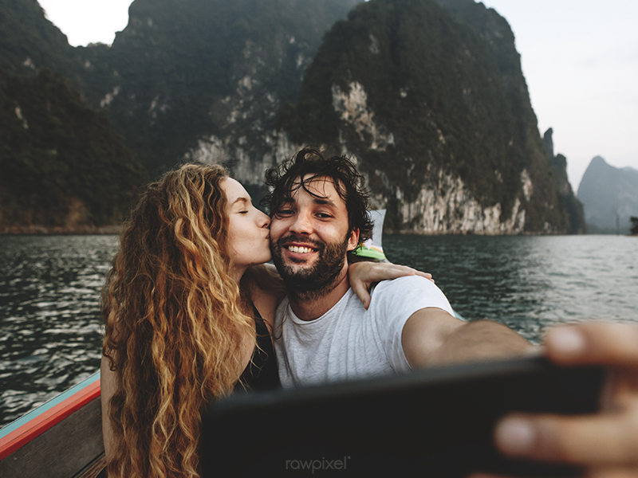
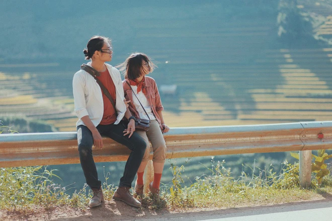

**1. Lên kế hoạch cụ thể**
Bạn nên dành thời gian tìm hiểu các hoạt động và địa điểm thú vị, đồng thời cùng người yêu lên kế hoạch cụ thể để chuyến đi diễn ra một cách suôn sẻ. Việc ngồi lại cùng nhau, thảo luận và xác định rõ ràng ý tưởng trước khi bắt đầu chuyến du lịch là rất quan trọng. Điều này giúp bạn và người ấy tiết kiệm thời gian và tận hưởng trọn vẹn chuyến đi đầu tiên. Tuy nhiên, không cần quá cứng nhắc tuân theo kế hoạch, chỉ cần sắp xếp thời gian cho các hoạt động một cách hợp lý là đủ.

#### _Ảnh: Sưu tầm_

**2. Chọn hoạt động phù hợp với sở thích của cả hai**

Trong chuyến du lịch, cả hai bạn cần tôn trọng sở thích cá nhân của nhau. Hãy phân chia thời gian của chuyến đi sao cho hợp lý, một phần dành cho những gì bạn thích và phần còn lại cho những hoạt động mà đối phương ưa chuộng. Điều này sẽ giúp cả hai cảm thấy hài lòng, tránh được những tranh cãi không cần thiết. Khi đi du lịch cùng nhau, việc mỗi người có mong muốn tham quan những nơi khác nhau là điều bình thường. Vì vậy, trò chuyện để tìm ra những hoạt động mà cả hai đều thích là cách tốt nhất. Nếu không thể thống nhất, hãy ngồi lại và cùng nhau đưa ra phương án tốt nhất.

#### _Ảnh: Sưu tầm_

**3. Trân trọng những điều nhỏ bé**

Hãy biết quý trọng những hành động nhỏ bé mà đối phương làm cho bạn, vì mối quan hệ phần lớn dựa trên những điều đó. Trong các chuyến du lịch, các cặp đôi thường nên nhìn vào bức tranh toàn cảnh. Ngoài việc lên kế hoạch cho những trải nghiệm thú vị và lãng mạn, bạn và người ấy cũng nên để ý và trân trọng những cử chỉ quan tâm nhỏ bé từ đối phương. Dù những điều đó có thể rất nhỏ, chúng vẫn thể hiện rằng người ấy rất yêu và trân trọng bạn.

*Ảnh: Sưu tầm*

**4. Đừng uống quá nhiều rượu, bia**

Chuyến du lịch với người yêu có thể là lý do tuyệt vời để uống hết ly này đến ly khác, thậm chí đến mức say mèm. Liệu còn dịp nào khác mà ta có thể thoải mái như vậy?
Tuy nhiên, hãy để ý đến tửu lượng của mình nếu bạn định uống vài ly trong chuyến đi. Bạn chắc chắn không muốn dành phần lớn kỳ nghỉ để ngồi… nôn mửa trong nhà vệ sinh khách sạn trong khi người yêu phải bất lực vỗ lưng cho mình.

**5. Vừa phiêu lưu, vừa thư giãn**

Đây là lời khuyên quan trọng cho bất kỳ kế hoạch du lịch nào, đặc biệt là khi đi du lịch với người yêu. Nếu bạn chỉ lười biếng nghỉ ngơi trong khách sạn suốt chuyến đi, khả năng cao cả hai sẽ cảm thấy chán nản. Dù nghỉ ngơi là cần thiết, nhưng nếu đó là tất cả những gì bạn làm trong suốt chuyến đi, sẽ khó mà tạo ra những kỷ niệm đáng nhớ.

#### _Ảnh: Sưu tầm_

Ngược lại, nếu bạn liên tục tham gia vào những hoạt động phiêu lưu và mạo hiểm mà không dành thời gian để thư giãn, cả hai có thể sẽ trở nên cáu kỉnh vì mệt mỏi. Do đó, hãy cố gắng duy trì sự cân bằng giữa việc khám phá và nghỉ ngơi để có một kỳ nghỉ thật tuyệt vời.

**6. Hạn chế dùng điện thoại**

       Nhiều người tin rằng đây là một bí quyết vô cùng quan trọng cho những chuyến du lịch với người yêu. Không ít cặp đôi trẻ ngày nay có xu hướng liên tục chia sẻ hàng loạt ảnh du lịch, cập nhật mọi khoảnh khắc của hai người cho cả thế giới thấy. Điều này hoàn toàn bình thường và bạn có quyền đăng những hình ảnh đáng yêu bên người ấy, chỉ cần nhớ rằng đó không phải là ưu tiên hàng đầu của chuyến đi.

Nếu bạn dành quá nhiều thời gian để chụp được bức ảnh tình yêu hoàn hảo, bạn có thể vô tình bỏ lỡ những khoảnh khắc thực sự đáng trân trọng bên người mình yêu. Hãy tập trung vào trải nghiệm hiện tại và tận hưởng những giây phút bên nhau thay vì chỉ quan tâm đến newsfeed trên Facebook hay Instagram. Việc sống trọn vẹn trong từng khoảnh khắc không chỉ tạo ra kỷ niệm đẹp mà còn giúp cả hai bạn gắn kết hơn. Thay vì để chiếc điện thoại chi phối, hãy để trái tim dẫn lối trong chuyến đi của bạn.

**7 Hãy luôn nhớ đến mục đích của chuyến du lịch**

        Dù chuyến đi có thú vị đến đâu thì cũng sẽ rất dễ gặp phải căng thẳng hơn bình thường. Áp lực về tiền bạc, thời gian, việc phải đạt đủ mọi mục tiêu trong "bucket list", và áp lực để đảm bảo cả hai đều có thời gian vui vẻ, có thể khiến bạn cảm thấy quá tải. Điều này có thể khiến bạn lạc hậu nếu bạn quên mục đích chính của chuyến du lịch: tận hưởng niềm vui!

Hãy để niềm vui và sự hứng khởi tự nhiên đến với bạn, vì mọi nỗ lực ép buộc niềm vui thường dẫn đến kết quả không như ý. Mọi cặp đôi có thể xảy ra mâu thuẫn, tranh cãi về nhiều vấn đề khác nhau. Tuy nhiên, chỉ cần cả hai luôn nhớ rằng mục tiêu của việc đi du lịch với người yêu là để vui vẻ, thư giãn, mọi thứ sẽ được giải quyết và sẽ còn nhiều chuyến đi tuyệt vời hơn trong tương lai!
