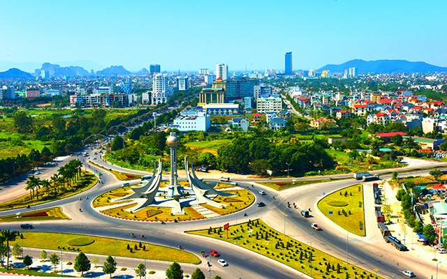
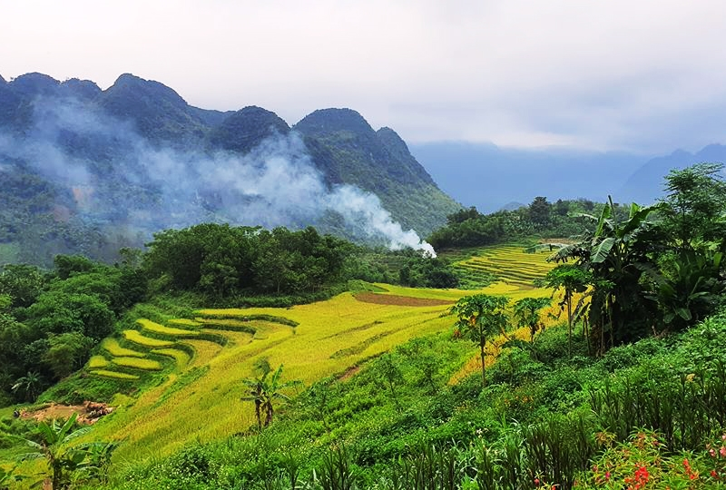
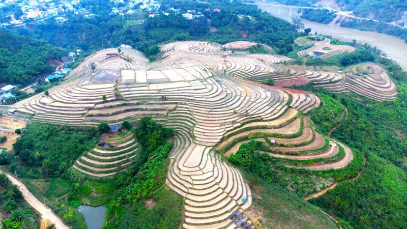
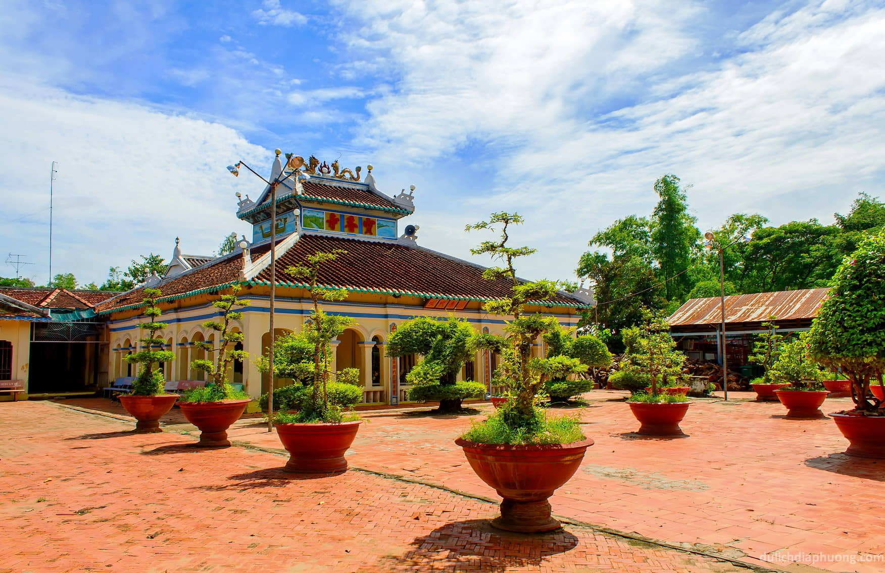
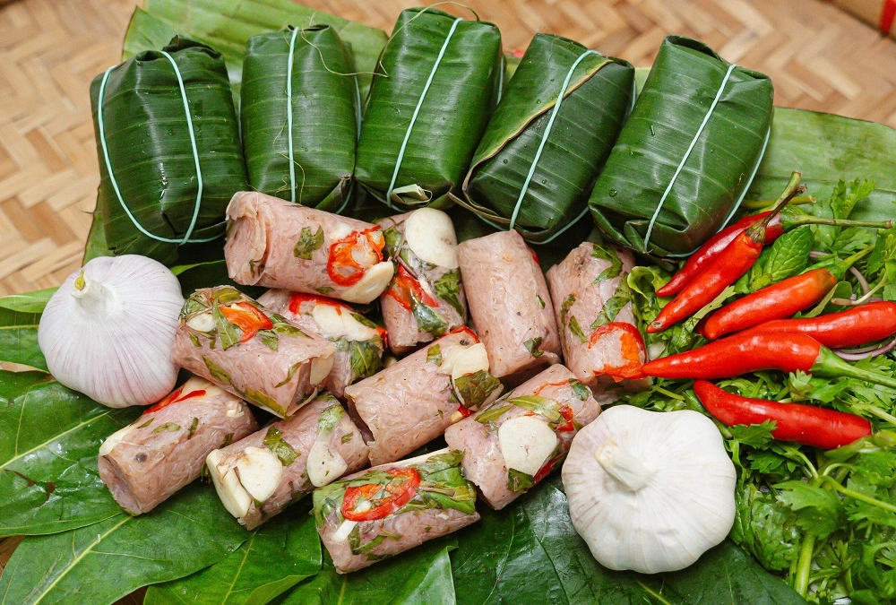
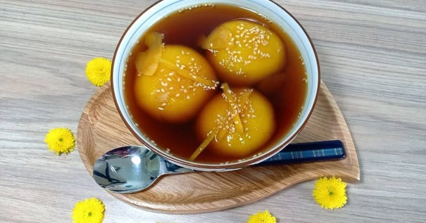
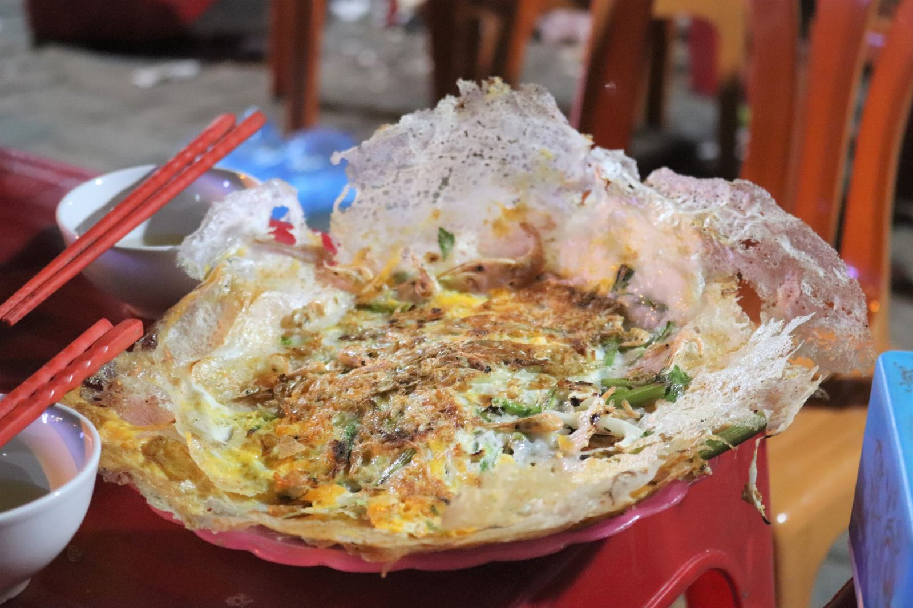

**1. Giới thiệu về Thanh Hóa**
Thanh Hóa được xem như là một tỉnh chuyển tiếp đặc biệt trên nhiều mặt. Về hành chính, nó nằm trong khu vực Bắc Trung Bộ, tiếp giáp với khu vực Tây Bắc Bộ và đồng bằng Bắc Bộ. Về địa chất, phần núi Thanh Hóa là phần mở rộng của dãy núi Tây Bắc Bộ, trong khi đồng bằng của Thanh Hóa là một trong những đồng bằng lớn nhất trong vùng Trung Bộ, chỉ một phần nhỏ (phía bắc huyện Nga Sơn) thuộc đồng bằng châu thổ sông Hồng.

Về khí hậu, Thanh Hóa mang kiểu khí hậu vừa của miền Bắc và miền Trung, tạo điều kiện cho sự phong phú và đa dạng trong sinh thái và văn hóa của nơi này.

**2. Thời điểm lý tưởng để đến Thanh Hóa**

          Thời điểm tốt nhất để khám phá Thanh Hóa phụ thuộc vào mục đích của bạn và hoạt động bạn muốn tham gia. Tuy mùa hè từ tháng 4 đến cuối tháng 8 thường là thời gian lý tưởng cho việc tận hưởng bãi biển với thời tiết khô ráo và nắng nóng, nhưng cũng có thể đối mặt với cơn bão trong khoảng từ tháng 6 đến tháng 8.

        Nếu bạn muốn khám phá vùng Tây Thanh Hóa, như Pù Luông, thì thời gian tốt nhất là từ tháng 4 đến tháng 6 hoặc từ tháng 9 đến tháng 11. Lúc này, thời tiết ít mưa hơn, giúp cho việc

leo núi, thám hiểm thiên nhiên trở nên dễ dàng hơn và an toàn hơn. Bạn có thể tận hưởng khung cảnh thiên nhiên hùng vĩ, những cánh rừng xanh biếc và những thác nước hùng vĩ mà vùng Tây Thanh Hóa mang lại mà không lo bị ảnh hưởng bởi mưa lớn hoặc lũ lụt.

        Tuy nhiên, nếu bạn muốn khám phá văn hóa và lịch sử của Thanh Hóa, bạn có thể thăm các điểm tham quan như Cố đô Hoằng Hóa, Den Cổ, hoặc chùa Trúc Lâm Bạch Mã vào bất kỳ thời điểm nào trong năm. Thanh Hóa với những di tích lịch sử và văn hóa phong phú sẽ chào đón bạn mọi lúc, đem lại những trải nghiệm tuyệt vời và sâu sắc về văn hóa dân tộc Việt Nam.

**3. Phương tiện**

Khi đến Thanh Hóa, có một số phương tiện bạn có thể sử dụng để thuận tiện hơn cho việc tham quan.

Xe máy: Đối với những người muốn trải nghiệm cung đường một cách linh hoạt và tự do, việc sử dụng xe máy là lựa chọn hàng đầu. Điều này cho phép bạn dễ dàng di chuyển qua lại giữa các điểm tham quan và khám phá các khu vực khác nhau của Thanh Hóa.

Xe ô tô: Nếu bạn đến từ Hà Nội, việc sử dụng xe ô tô là một lựa chọn tiện lợi. Với khoảng cách khoảng 150km, điều hành trình từ Hà Nội đến Thanh Hóa không quá xa, đặc biệt khi bạn sử dụng tuyến đường cao tốc Hà Nội – Ninh Bình. Chỉ mất khoảng 3 tiếng lái xe, bạn đã có thể đến TP Thanh Hóa và tiếp tục hành trình khám phá.

Xe bus: Với một mạng lưới tuyến xe buýt tương đối phát triển, việc sử dụng xe bus là một lựa chọn tiết kiệm và thuận tiện để di chuyển trong Thanh Hóa. Tuy nhiên, không phải mọi địa điểm đều thuận tiện cho việc đi bằng xe bus, nhưng đây vẫn là một phương tiện chấp nhận được nếu bạn không có phương tiện cá nhân.

4.Những địa điểm không nên bỏ lỡ

Với quá nhiều lựa chọn hoặc khi bạn bối rối không biết bắt đầu từ đâu khi đến Thanh Hóa, dưới đây là ba địa điểm mà bạn không thể bỏ qua:

Pù Luông

Khu bảo tồn thiên nhiên Pù Luông thuộc hai huyện Bá Thước và Quan Hóa, Thanh Hóa có diện tích hơn 17.600ha cùng hệ động thực vật rất phong phú. Với vẻ đẹp hoang sơ của rừng nhiệt đới, nơi đây là một trong những điểm du lịch Thanh Hóa thu hút được rất nhiều bạn trẻ.

2.Mường Lát

Mường Lát, một huyện vùng cao của Thanh Hóa, nằm cách trung tâm tỉnh khoảng 200km. Với vị trí giáp ranh với Lào, Mường Lát sở hữu cảnh quan thiên nhiên tuyệt đẹp. Điểm đặc biệt của Mường Lát là nơi kết thúc của cung đường "Đường Tre - Suối Muống", một con đường hấp dẫn bắt đầu từ Co Lương (tỉnh Hòa Bình) và dọc theo sông Mã. Ngoài ra, Mường Lát còn có cửa khẩu Tén Tằn với nước Lào, và mốc biên giới số 281 trong hệ thống các cột mốc biên giới Việt - Lào.

**3 .Đền thờ Mai An Tiêm**

Đền thờ Mai An Tiêm thuộc huyện Nga Sơn, nằm cách huyện lỵ Nga Sơn 5km về phía Đông Bắc. Ngôi đền này mang huyền thoại Mai An Tiêm được lưu truyền từ bao đời nay. An Tiêm là người có công khai phá xây dựng đất Nga Sơn của đất nước, dưa hấu Mai An Tiêm chính là sản vật cực kỳ nổi tiếng ở Nga Sơn.

**5. Top món ăn nhất định phải thử**

**Nem chua**
Nem chua Thanh Hóa được làm từ thịt nạc, bì thái chỉ, tiêu, ớt, tỏi và lá đinh lăng, được gói gọn bên ngoài bởi rất nhiều lớp lá chuối. Thịt nạc được chọn là loại thịt nạc, ngon, tươi, không dính mỡ, không dính gân, trộn đều với bì luộc thái chỉ, gia vị. Nem chua sẽ không thể thiếu được một chút ớt để làm vị thêm đậm đà, tiêu để dậy mùi, một chút tỏi để khử trùng và một vài lá đinh lăng.

**Bánh nhè**
Bánh nhè có hình dạng giống bánh trôi nước. Vỏ bánh làm từ bột nếp dẻo, nhân đậu xanh và dừa bào sợi. Bánh được nấu bằng đường mật mía và gừng, là thức quà chiều dân dã của người xứ Thanh. Món bánh đặc sản Thanh Hóa này thường được bán bởi các cô hàng rong trên đường, thế nên, du khách muốn thưởng thức có thể tới chợ Vườn Hoa.

**Bánh khoái tép nồi gang**

Bánh khoái khá giống bánh xèo Nam bộ về cách chế biến, thế nhưng nguyên liệu lại khác, mang nét đặc trưng của Thanh Hóa, bao gồm rau cần, bắp cải, thì là thái sợi nhỏ và tép tươi. Bánh khoái chấm cùng nước mắm pha chua ngọt và sung ghém rất hợp vị.
Thỉnh thoảng người bán sẽ thay tép tươi bằng trứng gà để thay đổi vị của món ăn. Các bạn có thể dễ dàng tìm thấy món này ở các phố Trường Thi, Đào Duy Từ, Hàn Thuyên, chợ Vườn Hoa tại thành phố Thanh Hóa.

